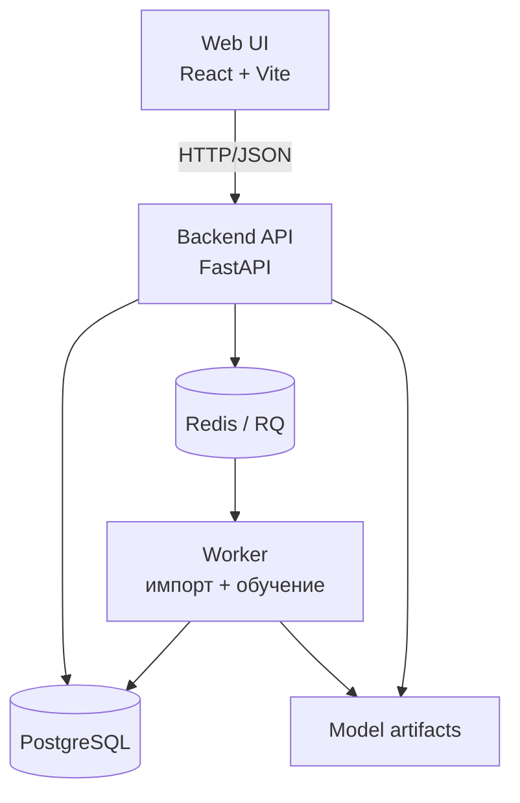

# SideQuest — персональный рекомендатор игр

Веб-сервис, который помогает выбрать следующую игру. Пользователь отмечает любимые игры,
жанры, бюджет и стоп-теги — сервис выдаёт топ-10 персональных рекомендаций с объяснением
каждой и учится на оценках «интересно» / «не интересно».

Под капотом — не «чат с LLM», а воспроизводимый ML-пайплайн: три подхода к рекомендациям
(popularity baseline, content-based, collaborative), offline-evaluation с временным сплитом,
fallback при сбое модели, фоновое переобучение и метрики.

> Статус: **День 1 из 6** — каркас, данные, EDA, Docker Compose с `/health`.

## Архитектура



Подробнее — [docs/architecture.md](docs/architecture.md).

## Технологии

| Слой | Выбор | Почему |
|---|---|---|
| Backend | Python 3.13, FastAPI, SQLAlchemy 2, Alembic | рекомендованный стек ТЗ; типизация через Pydantic |
| БД | PostgreSQL 17 | реляционная модель сущностей, миграции |
| Очередь | Redis + RQ | две редкие фоновые задачи — RQ минимален и объясним; worker живёт в Docker |
| ML | scikit-learn, scipy | классические подходы, воспроизводимость |
| Frontend | React + Vite | простой SPA для демонстрации сценария |

Ключевые решения и их обоснования — в [DECISIONS.md](DECISIONS.md).

## Данные

Источник: [Game Recommendations on Steam](https://www.kaggle.com/datasets/antonkozyriev/game-recommendations-on-steam)
(Kaggle, автор Anton Kozyriev).

- **Лицензия:** CC0: Public Domain. Персональных данных нет — user ID анонимизированы автором датасета.
- **Версия:** 28 (обновлён 2024-08-14). **Дата скачивания:** 2026-07-20.
- **Состав:**
  - `games.csv` — ~51k игр: название, дата релиза, рейтинг, цена;
  - `games_metadata.json` — описания и теги игр;
  - `users.csv` — ~14M пользователей (анонимные ID, счётчики);
  - `recommendations.csv` — 41M+ отзывов: user, game, is_recommended, часы, дата.
- Почему он, а не предложенный в ТЗ Steam Reviews Dataset: есть цена (фильтр по бюджету),
  теги и описания (content-based), даты (временной сплит для honest evaluation) и явная
  бинарная оценка. Обоснование — в [DECISIONS.md](DECISIONS.md).
- Сырые данные в репозиторий не коммитятся (`data/raw/` в .gitignore); в репо будет только
  маленький demo-набор. Скачивание и фиксация версии/хешей:

```bash
python ml/download_data.py   # скачает в data/raw и создаст manifest.json c sha256
```

- Результаты EDA (sparsity, распределения, топ-теги) — [docs/eda.md](docs/eda.md).
- Какие поля исключаются из обучения и почему — будет описано вместе с train/test-сплитом
  (День 3); принцип: никаких признаков, появляющихся после момента рекомендации.

## Быстрый старт

Требования: Docker + Docker Compose.

```bash
git clone <repo-url> sidequest && cd sidequest
docker compose up --build
# API: http://localhost:8000, Swagger: http://localhost:8000/docs
curl http://localhost:8000/health
```

`.env` не обязателен (в compose есть значения по умолчанию); шаблон — [.env.example](.env.example).

## Разработка

```bash
# окружение (Python 3.13)
python -m venv .venv && .venv\Scripts\activate   # Windows
pip install -r backend/requirements.txt

# тесты и линт
pytest
ruff check .

# EDA по сырым данным
python ml/eda.py
```

## API

Будет доступно в Swagger (`/docs`). Реализовано на текущий момент:

| Метод | Путь | Описание |
|---|---|---|
| GET | `/health` | статус приложения и зависимостей (db, redis) |

Полный набор endpoint'ов (users, preferences, interactions, recommendations, admin) — Дни 2–5.

## Метрики моделей

Таблица сравнения baseline / content-based / collaborative появится после Дня 3
(Precision@10, coverage, diversity, latency; временной сплит, фиксированный seed).

## Ограничения и следующие шаги

- День 1: нет UI, нет БД-схемы, нет моделей — только каркас, данные и здоровье сервиса.
- План: День 2 — миграции, demo-импорт, onboarding, baseline; День 3 — evaluation +
  content-based; День 4 — collaborative + feedback; День 5 — фон, fallback, тесты, CI;
  День 6 — документация, инциденты, видео.
