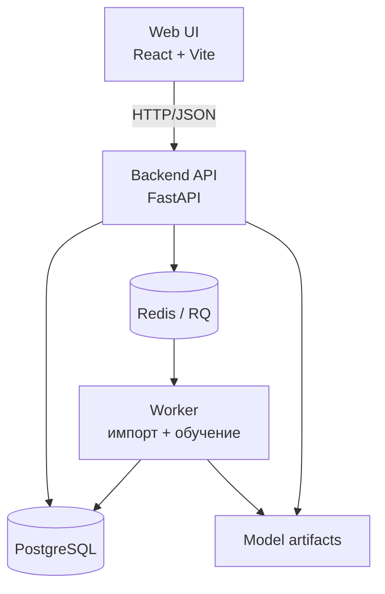

# SideQuest — персональный рекомендатор игр

Веб-сервис, который помогает выбрать следующую игру. Пользователь отмечает любимые игры,
жанры, бюджет и стоп-теги — сервис выдаёт топ-10 персональных рекомендаций с объяснением
каждой и учится на оценках «интересно» / «не интересно».

Под капотом — не «чат с LLM», а воспроизводимый ML-пайплайн: три подхода к рекомендациям
(popularity baseline, content-based, collaborative), offline-evaluation с временным сплитом,
fallback при сбое модели, фоновое переобучение и метрики.


> Статус: **День 5 из 6** — фоновые импорт и переобучение (RQ worker) с promotion gate,
> fallback при сбое/таймауте модели, `/metrics`, 30 тестов (включая интеграционные), CI.

## Архитектура



Подробнее — [docs/architecture.md](docs/architecture.md).

## Технологии

| Слой | Выбор | Почему |
|---|---|---|
| Backend | Python 3.13, FastAPI, SQLAlchemy 2, Alembic | рекомендованный стек ТЗ; типизация через Pydantic |
| БД | PostgreSQL 17 | реляционная модель сущностей, миграции |
| Очередь | Redis + RQ | две редкие фоновые задачи — RQ минимален и объясним; worker живёт в Docker |
| ML | scikit-learn, scipy | классические подходы, воспроизводимость |
| Frontend | React + Vite | простой SPA для демонстрации сценария |

Ключевые решения и их обоснования — в [DECISIONS.md](DECISIONS.md).

## Данные

Источник: [Game Recommendations on Steam](https://www.kaggle.com/datasets/antonkozyriev/game-recommendations-on-steam)
(Kaggle, автор Anton Kozyriev).

- **Лицензия:** CC0: Public Domain. Персональных данных нет — user ID анонимизированы автором датасета.
- **Версия:** 28 (обновлён 2024-08-14). **Дата скачивания:** 2026-07-20.
- **Состав:**
  - `games.csv` — ~51k игр: название, дата релиза, рейтинг, цена;
  - `games_metadata.json` — описания и теги игр;
  - `users.csv` — ~14M пользователей (анонимные ID, счётчики);
  - `recommendations.csv` — 41M+ отзывов: user, game, is_recommended, часы, дата.
- Почему он, а не предложенный в ТЗ Steam Reviews Dataset: есть цена (фильтр по бюджету),
  теги и описания (content-based), даты (временной сплит для honest evaluation) и явная
  бинарная оценка. Обоснование — в [DECISIONS.md](DECISIONS.md).
- Сырые данные в репозиторий не коммитятся (`data/raw/` в .gitignore); в репо будет только
  маленький demo-набор. Скачивание и фиксация версии/хешей:

```bash
python ml/download_data.py   # скачает в data/raw и создаст manifest.json c sha256
```

- Результаты EDA (sparsity, распределения, топ-теги) — [docs/eda.md](docs/eda.md).
- Какие поля исключаются из обучения и почему — будет описано вместе с train/test-сплитом
  (День 3); принцип: никаких признаков, появляющихся после момента рекомендации.

## Быстрый старт

Требования: Docker + Docker Compose.

```bash
git clone <repo-url> sidequest && cd sidequest
docker compose up --build
# UI: http://localhost:5173, API: http://localhost:8000 (Swagger: /docs)

# миграции и demo-данные (первый запуск)
pip install -r backend/requirements.txt
cd backend && alembic upgrade head && python import_demo.py && cd ..
```

Compose поднимает пять сервисов: db (Postgres 17, наружу 127.0.0.1:5433), redis, backend
(FastAPI), worker (RQ — фоновые импорт и переобучение), frontend (nginx со статикой
и прокси `/api`). Для локальной разработки фронта остаётся `cd frontend && npm run dev`.

`.env` не обязателен (в compose есть значения по умолчанию); шаблон — [.env.example](.env.example).

## Разработка

```bash
# окружение (Python 3.13)
python -m venv .venv && .venv\Scripts\activate   # Windows
pip install -r backend/requirements.txt

# тесты и линт
pytest
ruff check .

# EDA по сырым данным
python ml/eda.py
```

## API

Документация — в Swagger (`/docs`). Основные endpoint'ы:

| Метод | Путь | Описание |
|---|---|---|
| GET | `/health` | статус приложения и зависимостей (db, redis) |
| GET | `/metrics` | живая статистика: запросы, ошибки, latency, распределение моделей, активная версия |
| POST | `/users` | создать пользователя |
| GET | `/users/demo` | готовые demo-профили |
| POST | `/users/{id}/preferences` | жанры, максимальная цена, стоп-теги (минимум один) |
| GET | `/games?query=` | поиск игр по названию |
| POST | `/users/{id}/interactions` | лайк/дизлайк/«уже играл»; идемпотентен (повтор → `duplicate: true`) |
| GET | `/users/{id}/recommendations` | топ-10 с объяснениями и фактической версией модели |
| GET | `/admin/models/current` | активная версия модели с метриками |
| POST | `/admin/retrain` | фоновое переобучение (RQ) с promotion gate; `?simulate_degraded=true` — инцидент №6 |
| POST | `/admin/import` | фоновый импорт demo-данных |
| GET | `/admin/jobs/{id}` | статус фоновой задачи |

Надёжность: повторный feedback не создаёт дубликат; при недоступном/повреждённом артефакте
или таймауте модели — fallback на популярностный baseline с теми же фильтрами (фактическая
модель честно указана в ответе); переобучение активирует новую версию **только если она
бьёт baseline по P@10** (promotion gate), деградировавшая модель отклоняется. Логи содержат
request ID, user id, версию модели и длительность.

## Метрики моделей

Offline-evaluation на временном сплите: train — взаимодействия до 2022-01-01, test — 2022 год.
Каталог (топ-5000 игр) и порог активности пользователей (≥5 отзывов, 50k, seed 42) отбираются
**только по train-периоду** — иначе отбор подсматривает в будущее и смещает сравнение.
Параметры и sha256 исходников — в `data/processed/split_manifest.json`, артефакты — в `ml/results/`.

| Модель | P@10 | R@10 | Coverage | Diversity | Latency mean | Latency p95 |
|---|---|---|---|---|---|---|
| random (якорь) | 0.0007 | 0.0026 | 97.6% | 0.932 | 0.2 ms | 0.2 ms |
| popularity (baseline) | 0.0075 | 0.0274 | 0.5% | 0.891 | <0.1 ms | <0.1 ms |
| popularity time-decay | 0.0080 | 0.0302 | 0.3% | 0.894 | <0.1 ms | <0.1 ms |
| content-based (TF-IDF) | 0.0089 | 0.0335 | 48.3% | 0.652 | 0.4 ms | 0.5 ms |
| item-item (collaborative) | 0.0201 | 0.0720 | 46.1% | 0.814 | 0.7 ms | 1.2 ms |
| ALS (implicit, дефолтные гиперпараметры) | 0.0134 | 0.0452 | 6.9% | 0.859 | 0.2 ms | 0.4 ms |
| hybrid (полная матрица) | 0.0207 | 0.0770 | 27.0% | 0.819 | 8.1 ms | 10.5 ms |
| **hybrid-artifact (то, что в serving)** | **0.0210** | 0.0747 | 35.4% | 0.812 | 4.1 ms | 5.4 ms |

**Главная метрика — Precision@10**: продукт показывает ровно 10 карточек, и доля попаданий
в них — то, что видит пользователь. Выводы сравнения:

- **Коллаборативный сигнал решает**: item-item и оба гибрида (P@10 0.0201–0.0210) в 2.7–2.8×
  лучше baseline и в ~30× лучше случайного. Разница внутри этой тройки — единицы попаданий
  на 20 000 слотов, статистически неразличимо; **serving-гибрид выбран не за дельту P@10,
  а за поведение**: популярностный член даёт осмысленную выдачу пользователям без истории
  (cold start) и приемлемый coverage.
- **`hybrid-artifact` — метрика ровно того артефакта, что отвечает в API** (top-20 усечённых
  соседей на игру): усечение не ухудшило качество и вдвое снизило latency. Формула eval и
  serving одна; отличие продового пула кандидатов (top-500 игр каталога) остаётся оговоркой.
- **ALS с дефолтами** (64 фактора, без confidence-весов и тюнинга) уступает соседям —
  вывод «на этих данных и без тюнинга», не приговор матричной факторизации.
- **Разрезы** (hybrid-artifact): 3+ лайков — P@10 0.0211 (n=1976); срез 1–2 лайка мал
  (n=24), его цифры — шум, приводим только с размером выборки.

**Урок методологии (воспроизводимый):** в первой версии сплита каталог отбирался по
all-time популярности — с утечкой тестового периода в дизайн эксперимента — и baseline
«выигрывал» (P@10 0.0085 vs 0.0074). После переноса отбора на train-период результат
перевернулся. Абсолютные значения P@10 при sparsity 99.994% и медиане 1 отзыв на
пользователя закономерно малы (случайная выдача дала бы ~0.0005 — модели лучше в ~15 раз).

Оговорки: eval-популяция — пользователи с ≥1 положительным отзывом в тесте; доля пустых
выдач репортится в артефактах (`empty_recs_share`, в текущем прогоне 0 у обеих моделей).

Исключённые из обучения поля и почему — в `split_manifest.json` (`excluded_fields`):
`hours` растут после момента рекомендации, `helpful/funny` появляются после публикации
отзыва, агрегаты каталога в eval заменены на train-only счётчики.

Воспроизведение и обучение serving-модели:

```bash
python ml/download_data.py     # сырые данные + manifest
python ml/split.py             # train/test-сплит + split_manifest.json
python ml/evaluate.py          # метрики всех моделей → ml/results/*.json
python ml/train_serving.py     # артефакт гибрида → ml/artifacts/hybrid_v2.json
cd backend && python register_model.py --name hybrid --version v2   # переключить serving
```

Устойчивость serving: артефакт гибрида удалён/повреждён → API автоматически отвечает
популярностным baseline с теми же фильтрами, фактическая модель честно указывается
в ответе (`model_name`/`model_version`) и в `/admin/models/current`.

## Ограничения и следующие шаги

- День 1: нет UI, нет БД-схемы, нет моделей — только каркас, данные и здоровье сервиса.
- План: День 2 — миграции, demo-импорт, onboarding, baseline; День 3 — evaluation +
  content-based; День 4 — collaborative + feedback; День 5 — фон, fallback, тесты, CI;
  День 6 — документация, инциденты, видео.
