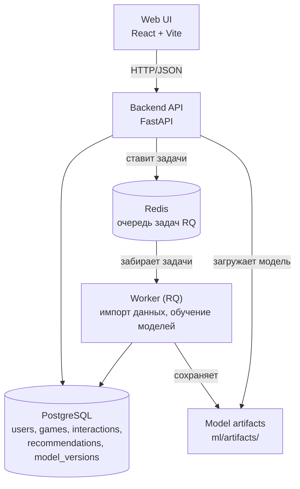

# Архитектура SideQuest

## Схема

## Компоненты

| Компонент | Технология | Ответственность |
|---|---|---|
| Web UI | React + Vite | onboarding, выдача рекомендаций, feedback-кнопки |
| Backend API | FastAPI + SQLAlchemy 2 + Alembic | HTTP API, валидация, выбор модели, fallback, логи, метрики |
| БД | PostgreSQL 17 | пользователи, игры, взаимодействия, рекомендации, версии моделей |
| Очередь | Redis + RQ | фоновые задачи: импорт данных, (пере)обучение |
| Worker | RQ worker (только в Docker) | выполняет задачи, не блокируя API |
| Артефакты | файлы в `ml/artifacts/` | сериализованные модели + метаданные (версия, метрики, параметры) |

## Ключевые потоки

1. **Рекомендации**: UI → `GET /users/{id}/recommendations` → API загружает активную
   модель → кандидаты → фильтры (бюджет, стоп-теги) → топ-10 с объяснениями → ответ.
   При ошибке/таймауте модели — fallback: популярные игры с теми же фильтрами.
2. **Feedback**: UI → `POST /users/{id}/interactions` → запись в БД (идемпотентно,
   повторный feedback не создаёт дубликат) → участвует в следующем обучении.
3. **Обучение**: `POST /admin/retrain` → задача в Redis → worker обучает, пишет артефакт
   и строку в `model_versions` → serving переключается на новую версию.

## Fallback-цепочка

модель недоступна/таймаут → популярные игры с фильтрами по бюджету и стоп-тегам →
если и это недоступно — понятная ошибка API с request ID в логах.
